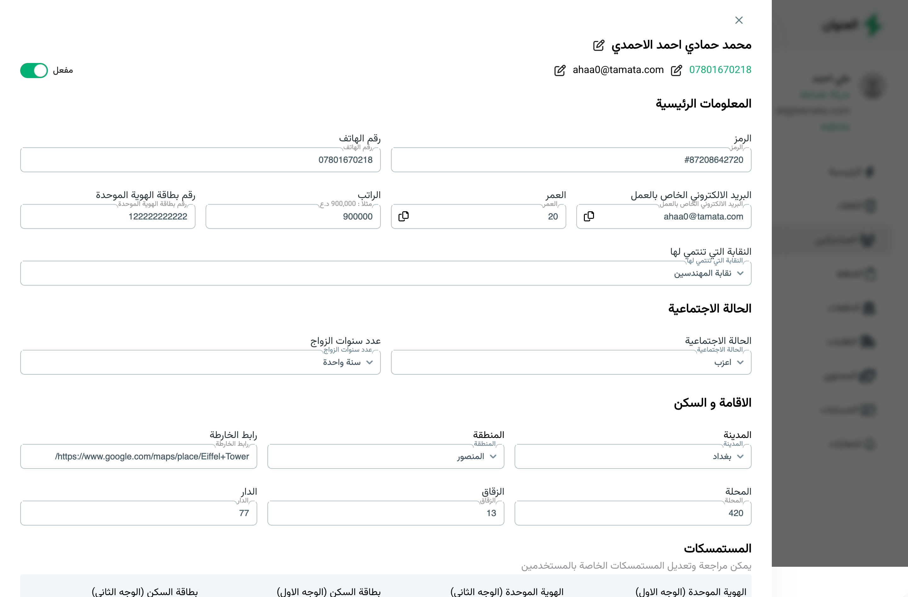

# React + Vite 

<!--  -->

Currently, two official plugins are available:

- [@vitejs/plugin-react](https://github.com/vitejs/vite-plugin-react/blob/main/packages/plugin-react/README.md) uses [Babel](https://babeljs.io/) for Fast Refresh
- [@vitejs/plugin-react-swc](https://github.com/vitejs/vite-plugin-react-swc) uses [SWC](https://swc.rs/) for Fast Refresh

## How to Run the Project

Follow these steps to set up and run the project on your local machine:

### Prerequisites

Ensure you have the following installed on your system:

- [Node.js](https://nodejs.org/) (LTS version recommended)
- [npm](https://www.npmjs.com/) or [yarn](https://yarnpkg.com/)

### Steps

1. **Clone the Repository:**

   ```bash
   git clone https://github.com/Aya-Jafar/React-Front-End-Task.git
   ```

2. **Install Dependencies:**

   Use npm or yarn to install the required dependencies:

   ```bash
   npm install
   # or
   yarn install
   ```

3. **Start the Development Server:**

   Start the Vite development server:

   ```bash
   npm run dev
   # or
   yarn dev
   ```

4. **Access the Application:**

   Open your browser and navigate to `http://localhost:5173` (default port) to view the application.


5. **Build for Production:**

   To create an optimized production build, run:

   ```bash
   npm run build
   # or
   yarn build
   ```

6. **Preview the Production Build:**

   To preview the production build locally, run:

   ```bash
   npm run preview
   # or
   yarn preview
   ```
